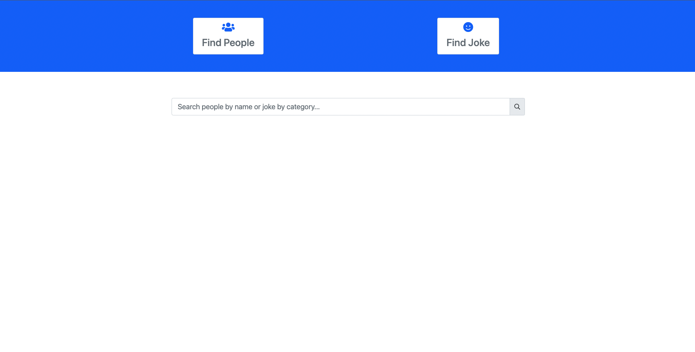
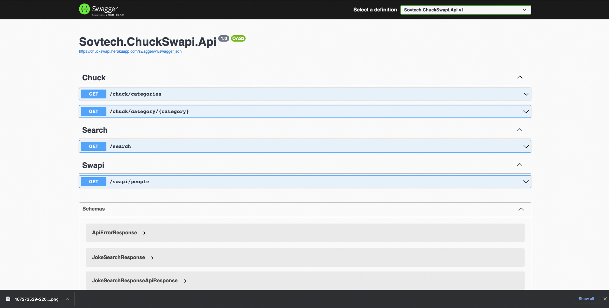

# chuck-swap-api




[](https://github.com/eskye/chuck-swap-api/actions/workflows/build-app.yml)

# Introduction

 Chuck Swap API is an openAPI compliant web service that abstracts away two downstream APIs; the [Chuck Norris API](https://api.chucknorris.io) and the [Star Wars API](https://swapi.dev/api/). 

# Technologies Used

* ASP.NET Core (.NET 6) Web API  
* SwaggerUI (OpenAPI)
* Angular 13 (Client)
* Bootstrap 5 (CSS Framework)
* Nginx (Proxy)
* Docker Compose

# How do I get started with Docker Compose?

To get started, follow the below steps:

1. Install .NET 6 SDK
2. Install the latest NodeJS 
3. Install Docker Desktop (for Windows) / Docker (for Linux/Mac)
4. Clone the Solution into your Local Directory
5. On the Repository root you can find the docker-compose.yml file
6. Run the below command to build and run the solution in Docker (requires a working Docker installation)
   
 ```sh
 docker-compose build --force-rm --no-cache && docker-compose up
```
7. Once the containers start successfully navigate to [http://localhost](http://localhost)
   
# Not using Docker. How do I get started?

You can also just run the solution without Docker by following the steps below:

1. Install .NET 6 SDK
2. Install the latest NodeJS 
3. Clone the Solution into your Local Directory
4. Navigate to the API directory (./API) and run the below command to get the API running:

```sh
 dotnet run --project src/Sovtech.ChuckSwapi.Api 
```

5. Open a browser, navigate to http://localhost:8080/swagger/index.html to view the Open API documentation.
   
6. Navigate to the Client directory (./Client) and run the below commands to get the Angular application running:

```sh
 npm install && npm start
```
7. Open a browser, navigate to http://localhost:4200 and you're all set!  
   
## Deployments

The chuck-swapi api is currently running on Heroku and the frontend is running on Netlify, and auto deployment has been enabled for the repository. which automatically, deploy update made to heroku through Github actions. 

Here's the URL of the deployed web api app on Heroku:
[https://chuckswapi.herokuapp.com/swagger/index.html](https://chuckswapi.herokuapp.com/swagger/index.html)

Here's the URL of the deployed frontend app on Netlify:
[https://chuckswapi.netlify.app](https://chuckswapi.netlify.app)


